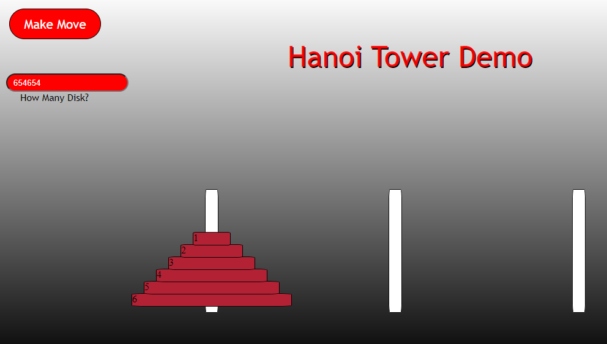

# Hanoi Tower Challenge

 

Title: Hanoi Towers (MiT week 10 project)

Object: Transfer all disk from original tower to any other tower one piece at a time. You cannot place a larger disk on top of a smaller one. This has been solved using Javascript. 

Installation: Download all files and upload them to your server. Once installed, navigate to index.html and enjoy!

License: This code is free to use for any occasion.
